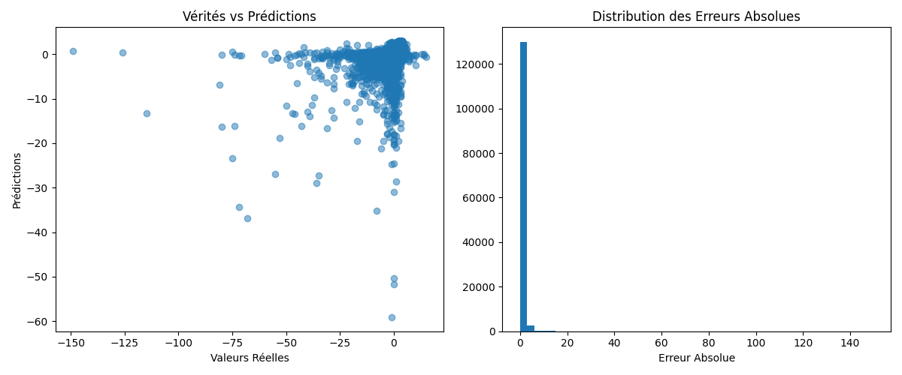

# Challenge Data - Prédiction du temps d'attente à quai (SNCF-Transilien)

## Description du projet
Ce projet vise à prédire le temps d'attente à quai des trains SNCF-Transilien en utilisant des modèles de Machine Learning (Random Forest) et des séries temporelles.

## 📂 Structure du projet
```
Challenge-Data-SNCF/
│── data/
│   ├── raw/
│   │   ├── x_train.csv
│   │   ├── x_test.csv
│   │   ├── y_train.csv
│   │   └── y_sample.csv
│── logs/
│   └── output.log
│── plots/
│   └── plot_results.png
│── src/
│   ├── data_processing.py
│   ├── main.py
│   ├── metrics_and_plots.py
│   ├── train_model.py
│   ├── predict.py
│── submissions/
│   └── submission.csv
│── .gitignore
│── README.md
└── requirements.txt
```

## Installation
1. Clonez le dépôt :
```bash
git clone https://github.com/Moussa-Kalla/Challenge-Data-SNCF
```

2. Créez un environnement virtuel et installez les dépendances :
```bash
python3 -m venv SNCF_env
source venv/bin/activate  # Sur macOS/Linux
venv\Scripts\activate  # Sur Windows
pip install -r requirements.txt
```

## Exécution du projet
Pour lancer l'entraînement et la prédiction :
```bash
python src/main.py
```

À chaque exécution :
- Les logs seront automatiquement sauvegardés dans `logs/output.log`.
- Le graphique des résultats sera enregistré dans `plots/plot_results.png`.

## Sortie des logs
Les logs détaillés se trouvent dans `logs/output.log`.

## Visualisation des résultats
Les performances du modèle sont également sauvegardées sous forme de graphique :



## Évaluation du modèle
Les métriques utilisées pour évaluer la performance du modèle sont :
- **MAE** (Mean Absolute Error)
- **MSE** (Mean Squared Error)
- **R² Score**


